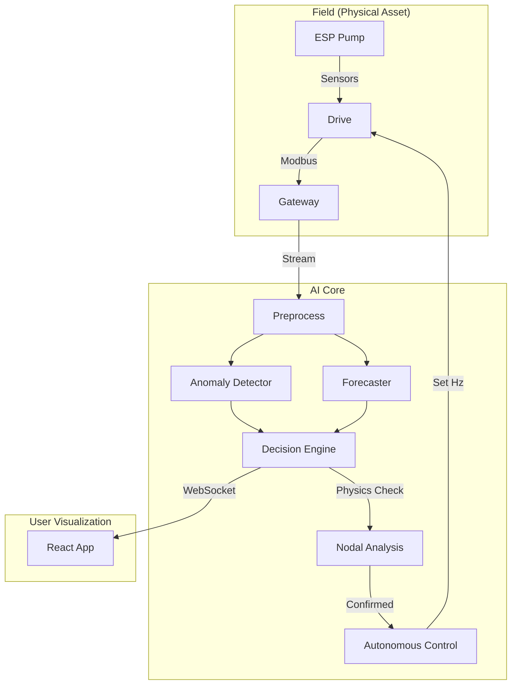

# 🛢️ ESP Digital Twin: Physics-Informed AI for Oil & Gas


## 💡 Overview

A **Physics-Informed AI Digital Twin** for **Electric Submersible Pumps (ESP)**. This system bridges the gap between traditional petroleum engineering and modern AI by combining:

1. **State-of-the-Art AI**: COPOD for Anomaly Detection & LSTM for Future Forecasting.
2. **Fundamental Physics**: Nodal Analysis & Pump Performance Curves to validate AI predictions.
3. **Real-Time Action**: An autonomous control loop that self-heals the system (e.g., curing Gas Lock) without human intervention.

---

## 🚀 Key Features

| Feature | Description | Technology |
| :--- | :--- | :--- |
| **Real-Time Monitoring** | High-density "Leucipa-style" dashboard visualizing 12+ sensors (PIP, Amps, Vibration, etc.). | React, Recharts, WebSocket |
| **Anomaly Detection** | Detects subtle failures (Gas Lock, Pump Wear) **24-48 hours** early. | Python (COPOD), PyOD |
| **Future Forecasting** | Predicts sensor trends **30 steps ahead** using Deep Learning. | PyTorch (Seq2Seq LSTM) |
| **Physics Validation** | Cross-checks AI alerts against **IPR/VLP Nodal Analysis** & **Pump Curves**. | SciPy, NumPy |
| **Autonomous Control** | Closed-loop system that auto-adjusts pump frequency (Hz) to prevent failure. | Custom Logic Engine |
| **Explainable AI (XAI)** | Tells you *why* an alert occurred (e.g., "Vibration is 80% responsible"). | Z-Score Feature Contribution |

---

## 🏗️ System Architecture

### 1. The Decision Workflow

Data flows from the wellhead to the AI, gets validated by Physics, and triggers Autonomous Action.



### 2. Autonomous Logic (The "Brain")

*How the system decides to intervene during a Gas Lock event.*


---

## 🛠️ Installation & Setup

### Prerequisites

* Python 3.10+
* Node.js 16+

### 1. Backend Setup (FastAPI)

```bash
# Clone the repository
git clone https://github.com/yourusername/esp-digital-twin.git
cd esp-digital-twin

# Install Python dependencies
pip install -r requirements.txt

# Start the Backend Server
python -m uvicorn backend.main:app --reload --port 8000
```

*API Documentation available at: `http://localhost:8000/docs`*

### 2. Frontend Setup (React)

```bash
# Navigate to frontend directory
cd frontend

# Install Node modules
npm install

# Start the Development Server
npm run dev
```

*Dashboard available at: `http://localhost:5173`*

---

## 📂 Project Structure

```bash
esp-digital-twin/
├── backend/                # FastAPI Application
│   ├── main.py             # Entry point
│   ├── routes/             # API Endpoints (Simulation, AI)
│   └── logic/              # Autonomous Logic & Physics Engine
├── frontend/               # React Application
│   ├── src/
│   │   ├── components/     # Reusable UI (Charts, Gauges)
│   │   ├── pages/          # Dashboard Views
│   │   └── hooks/          # WebSocket Hooks
├── src/                    # AI Model Training & Scripts
│   ├── train_copod.py      # Anomaly Detection Training
│   └── lstm_forecast.py    # LSTM Forecasting Model
├── data/                   # Synthetic & Real Datasets
└── assets/                 # Images & Diagrams
```

## 🤝 Contributing

Contributions are welcome! Please open an issue or submit a pull request for any improvements.

## 📄 License

This project is licensed under the MIT License - see the [LICENSE](LICENSE) file for details.
 in your project.
